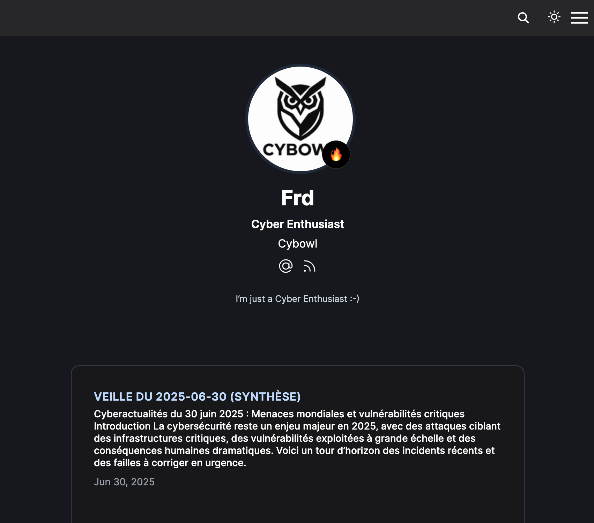

# [Cybowl - Un regard sur la Cyberveille](https://www.cybowl.eu)

**Cybowl** est une plateforme légère de veille cybersécurité, développée avec [**Hugo**](https://github.com/gohugoio/hugo) et propulsée par [**Hugo Blox**](https://docs.hugoblox.com/).

# ⁉️ Pourquoi Cybowl ?

Dans le domaine de la cybersécurité, rester informé est essentiel — mais suivre des dizaines de sources chaque jour peut vite devenir épuisant.

**Cybowl** automatise cette veille : il scanne des flux fiables francophones et anglophones, filtre les contenus pertinents via une sélection de mots-clés, puis génère des synthèses claires grâce à l’IA.

L’info cyber, sans la surcharge.

# ⚙️ Comment ça fonctionne ?

* **Agrégation automatisée** de flux de veille de qualité en français et en anglais ;
* **Synthèse par IA** (Mistral) pour des résumés clairs ;
* Une plateforme légère et rapide — sans distractions, juste l’essentiel.

---

_English version_

# [Cybowl - A Fresh Take on Cybersecurity Intelligence](https://www.cybowl.eu)

**Cybowl** is a lightweight cyber threat intelligence platform, built with [**Hugo**](https://github.com/gohugoio/hugo) and powered by [**Hugo Blox**](https://docs.hugoblox.com/)).

# ⁉️ Why Cybowl?

In cybersecurity, staying informed is critical — but keeping up with dozens of sources every day is exhausting.

**Cybowl** automates the noise: it scans trusted French and English-language feeds, filters the relevant content using smart keyword selection, and uses AI to generate clear, concise summaries.

Your daily cyber insights, without the daily grind.

# ⚙️ How it works

* **Automated content curation** from high-quality threat intel feeds in both French and English.
* **AI-powered summarization** (via Mistral) to deliver key takeaways at a glance.
* A lightweight, fast-loading site — no distractions, just insights.
